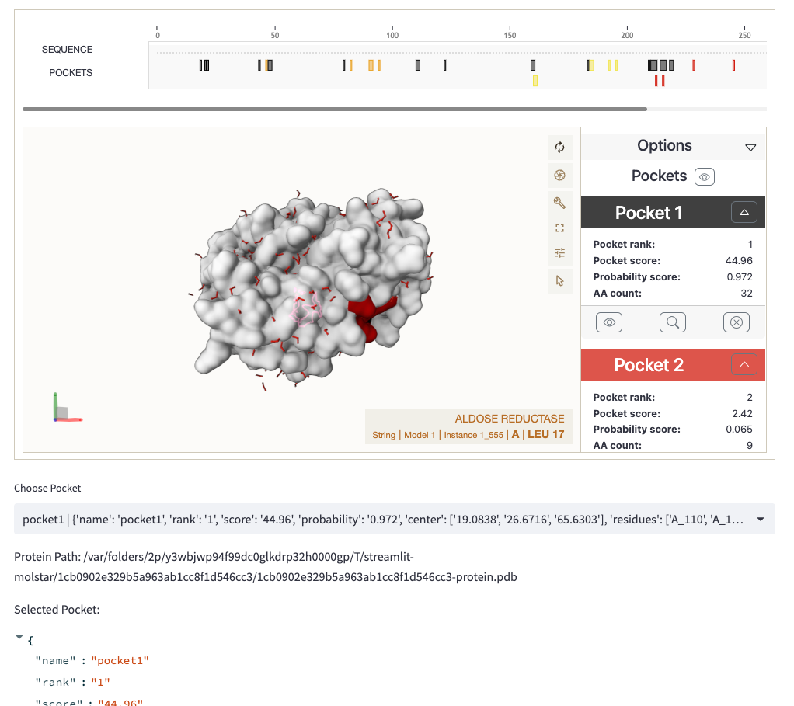
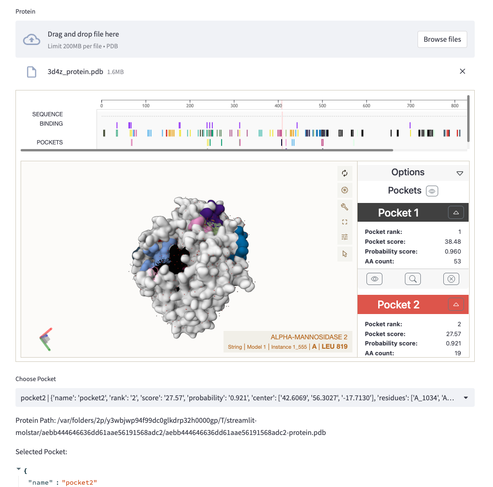
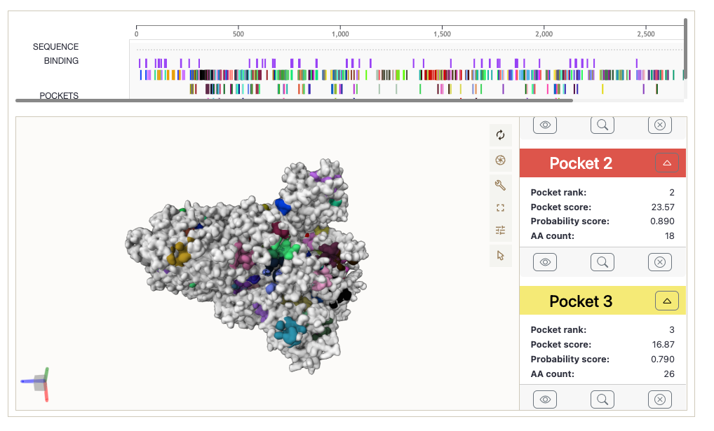
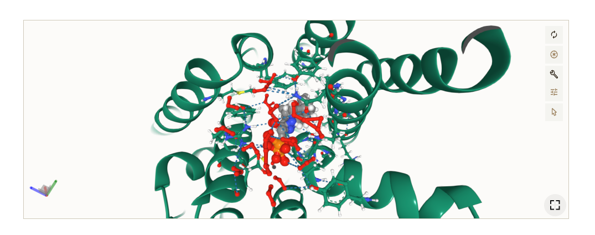
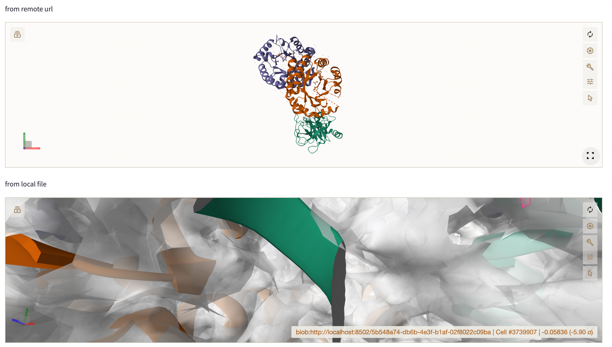

# streamlit-molstar

[Mol*](https://molstar.org/) (/'molstar/) is a modern web-based open-source toolkit for visualisation and analysis of large-scale molecular data.

## Install
`pip install streamlit-molstar`

## Usage

### Show Molecule

#### Protein with Traj

```python
    import streamlit as st
    from streamlit_molstar import st_molstar, st_molstar_rcsb, st_molstar_remote

    #st_molstar_rcsb('1LOL', key='xx')
    #st_molstar_remote("https://files.rcsb.org/view/1LOL.cif", key='sds')
    #st_molstar('examples/complex.pdb',key='3')
    st_molstar('examples/complex.pdb', 'examples/complex.xtc', key='4')
```


### Protein & Pocket

#### Select pocket from local protein (pockets predicted using p2rank)

```python
    import streamlit as st
    from streamlit_molstar.pocket import select_pocket_from_local_protein

    selected = select_pocket_from_local_protein("examples/pocket/protein.pdb", prank_home='/Users/wfluo/Downloads/p2rank_2.4/')
    if selected:
        protein_file_path, pocket = selected
        st.write('Protein Path: ', protein_file_path)
        st.write('Selected Pocket: ', pocket)
```



#### Select pocket from uploaded protein (pockets predicted using p2rank)

```python
    import streamlit as st
    from streamlit_molstar import st_molstar, st_molstar_rcsb, st_molstar_remote

    selected = select_pocket_from_upload_protein(prank_home='/Users/wfluo/Downloads/p2rank_2.4/')
    if selected:
        protein_file_path, pocket = selected
        st.write('Protein Path: ', protein_file_path)
        st.write('Selected Pocket: ', pocket)
```



#### Show Pockets


```python
    import streamlit as st
    from streamlit_molstar import st_molstar_pockets

    st_molstar_pockets(protein_file_path, structure_file_path, pockets_file_path)
```




## Docking

### Show docking result with ground truth

```python
    import streamlit as st
    from streamlit_molstar.docking import st_molstar_docking

    st_molstar_docking('examples/docking/2zy1_protein.pdb', 
                       'examples/docking/docking.2zy1.0.sdf',  gt_ligand_file_path='examples/docking/2zy1_ligand.sdf', key="5", height=240)

```




### Auto files

```python
    import streamlit as st
    from streamlit_molstar.auto import st_molstar_auto

    import streamlit as st

    st.set_page_config(layout="wide")

    st.write("from remote url")
    files = ["https://files.rcsb.org/download/3PTB.pdb", "https://files.rcsb.org/download/1LOL.pdb"]
    st_molstar_auto(files, key="6", height="320px")

    st.write("from local file")
    files = ['examples/7bcq.pdb', "examples/7bcq.mrc"]

    st_molstar_auto(files, key="7", height="320px")
```


